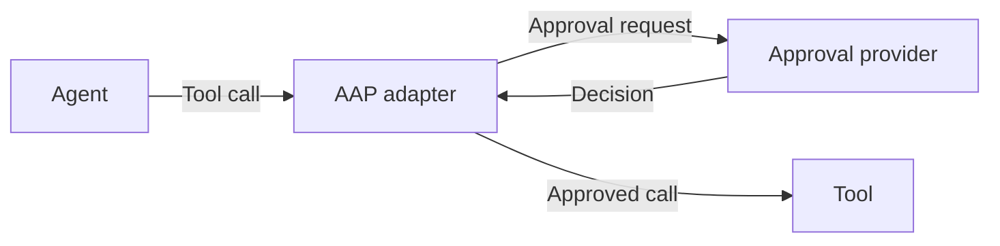

<p align="center">
  <a href="https://agentapprovalprotocol.io">
    <picture>
      <source media="(prefers-color-scheme: dark)" srcset="website/public/brand/aap-lockup-dark.svg">
      <source media="(prefers-color-scheme: light)" srcset="website/public/brand/aap-lockup-light.svg">
      
    </picture>
  </a>
</p>

<h1 align="center">Agent Approval Protocol</h1>

<p align="center">
  An open protocol for approving agent actions before they happen.
</p>

<p align="center">
  <a href="https://github.com/agentapprovalprotocol/agentapprovalprotocol"></a>
  <a href="https://agentapprovalprotocol.io/docs/adapters/cli"></a>
  <a href="LICENSE"></a>
</p>

<p align="center">
  <a href="#get-started">Get started</a> ·
  <a href="https://agentapprovalprotocol.io/docs/getting-started/introduction">Documentation</a> ·
  <a href="https://agentapprovalprotocol.io/specification/overview">Specification</a> ·
  <a href="https://github.com/agentapprovalprotocol/agentapprovalprotocol/issues">Report an issue</a>
</p>

Agents can write code, issue refunds, send messages and change production systems. Giving them that access means deciding which actions they can take on their own and which need approval.

**Agent Approval Protocol (AAP)** gives agents a common way to request approval before a tool call runs. An adapter connects the software running your agent to an approval provider, which can apply a policy, ask a person to review the action, or combine both.

## One place for approvals across your agents

A coding agent on a developer's laptop, a support agent on an application server and an operations agent on a cloud VM can all use the same approval provider. Your team can manage approval policies, review requests and keep a record of decisions in one place.

The provider can let routine actions proceed automatically and hold riskier ones for review. For example, it might approve looking up a customer's order immediately, but require a person to approve a refund.

Because AAP is an open protocol, you can choose your agents and approval provider independently. Use an existing provider or build one for your own review process. The same protocol connects them.

## How it works

1. **The agent proposes an action.** It calls a tool through the software running it.
2. **The adapter requests approval.** It captures the exact tool and arguments and holds the call before it runs.
3. **The provider decides.** It reviews the request and returns an outcome. The adapter allows the call only when it has a valid approval.



For a refund, approval covers the exact payment, amount and currency, for one execution attempt. Changing the amount requires a new approval. If the request is denied, expires or approval cannot be confirmed, the adapter blocks the call.

The agent receives the tool's result or an explanation of why the call did not run. The adapter handles the approval process on its behalf. See [the approval flow](https://agentapprovalprotocol.io/docs/concepts/approval-flow) for more.

An adapter controls only the tool calls that pass through it. Your agent's existing permissions still apply, and other paths to the same service need their own controls. See [adapter coverage and limits](https://agentapprovalprotocol.io/docs/concepts/adapter#where-the-adapter-runs).

## Get started

Choose an [approval provider](https://agentapprovalprotocol.io/docs/providers/overview) and get an instance token and its complete AAP URL. Then install the AAP CLI on the machine running your agent. It supports macOS and Linux on arm64 and amd64.

```sh
curl -fsSL https://downloads.agentapprovalprotocol.io/install.sh | sh
```

If prompted, reopen your terminal. Follow the setup guide for your agent:

[Claude Code](https://agentapprovalprotocol.io/docs/adapters/claude-code) · [Codex](https://agentapprovalprotocol.io/docs/adapters/codex) · [OpenClaw](https://agentapprovalprotocol.io/docs/adapters/openclaw) · [Pi](https://agentapprovalprotocol.io/docs/adapters/pi) · [Hermes Agent](https://agentapprovalprotocol.io/docs/adapters/hermes) · [DeepSeek Harness](https://agentapprovalprotocol.io/docs/adapters/deepseek)

Each guide explains how to connect your provider, check that approvals work and understand your agent's coverage and waiting limits. Most current adapters keep the agent running while approval is pending. AAP also defines a mode for agents that can suspend work and resume after a decision.

See the [CLI guide](https://agentapprovalprotocol.io/docs/adapters/cli) for direct downloads, updates, changing credentials and removal.

## Build with AAP

The [version 1 specification](https://agentapprovalprotocol.io/specification/overview) defines how adapters and providers work together. The [OpenAPI contract](https://agentapprovalprotocol.io/specification/reference/openapi) describes the HTTP API. Use these to add approval support to your agent or implement a provider.

The adapters are also available as a [Go library](https://agentapprovalprotocol.io/docs/adapters/cli#use-as-a-go-library). See the [embedding requirements](CONTRIBUTING.md#embedding-the-library) when using it in your own application.

## Contribute

Help improve the protocol, add an adapter or make the docs clearer. [Open an issue](https://github.com/agentapprovalprotocol/agentapprovalprotocol/issues) to discuss a change, or see the [contributor guide](CONTRIBUTING.md) to get started.

## License

[Apache 2.0](LICENSE). Code, specification and documentation are open source. See [third-party notices](CONTRIBUTING.md#license-and-third-party-notices) for included assets.
