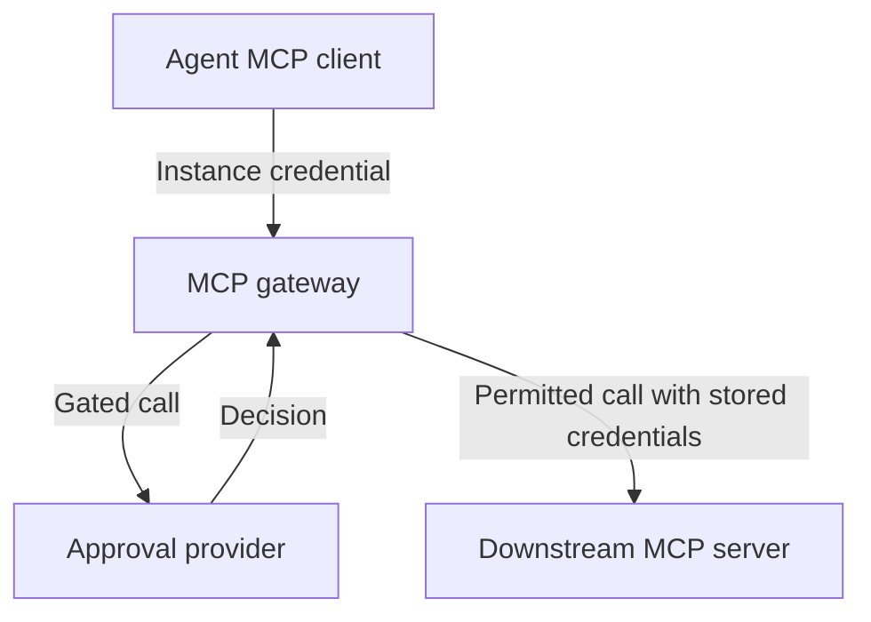

# MCP gateway

The MCP gateway is a remote adapter that holds downstream MCP credentials and controls calls to registered servers. An agent connects to one gateway endpoint using its own instance credential, and the gateway requests approval for gated calls before forwarding them.

This places approval where access to the downstream service is controlled. It is useful when agents should not hold the credentials that let them call that service directly.

## What it supports

| Capability | Current behavior |
| --- | --- |
| Transport | Streamable HTTP MCP for agents and downstream servers. |
| Aggregation | Tools from multiple registered servers, namespaced by server slug. |
| Downstream authentication | Stored static headers, OAuth connections or unauthenticated servers. |
| Approval identity | Requests use the calling agent's instance credential. |
| Waiting | Synchronous polling with a five-minute default approval window. |
| Deployment | The `withhuman-gateway` process or the gateway embedded in the withHuman server's single-binary deployment. |

## How it works

The gateway authenticates the connecting instance and loads the servers belonging to its organization. It holds the credentials needed to reach those servers and presents their tools through one MCP connection.

For each tool call, it checks the server's gated tools and the organization's adapter policy. Gated calls become approval requests using the agent's credential. An approved call is forwarded; other outcomes return a tool result explaining why it did not run. Ungated calls are forwarded directly. The gateway reports both kinds of calls to withHuman's activity record.

The gateway reaches the provider over HTTP. Its server registration, credential storage and configuration APIs currently belong to withHuman; those management operations are separate from the AAP approval exchange.

## Set up with withHuman

### 1. Enable the gateway

Use a withHuman deployment with its gateway enabled and reachable from the agent's machine. An administrator configures `WITHHUMAN_GATEWAY_ENCRYPTION_KEY` on the provider for stored downstream credentials and `WITHHUMAN_GATEWAY_PUBLIC_URL` for the agent-facing address.

In a split deployment, `withhuman-gateway` also needs `WITHHUMAN_GATEWAY_PROVIDER_URL` and the deployment's shared `WITHHUMAN_GATEWAY_TOKEN`. The provider and gateway use the same deployment token. The single-binary server starts its embedded gateway and manages that token itself.

The deployment token is for gateway-to-provider management. Agents connect using their own instance credentials.

### 2. Register a downstream server

Open **Gateway** at `/gateway` in withHuman, then register the downstream MCP server with its name, stable slug and URL.

Choose its authentication method. Store the required headers, complete the OAuth connection or select no authentication when the server requires none. withHuman stores the downstream credentials on the provider side.

### 3. Choose the tools to gate

On the server page, inspect the discovered **Tools** and choose a harmless tool to require approval for your first test. Save the configuration and activate the server revision. The gateway loads active configuration on its next poll, which is every 30 seconds by default.

Configure the calling agent's approval pipeline and reviewer in withHuman so a gated request can reach a decision.

### 4. Connect the agent

Use **Connect an agent** to create an agent instance and issue its credential, or use an existing instance that belongs to the same organization. Configure the agent's MCP client with these values:

| Setting | Value |
| --- | --- |
| Transport | Streamable HTTP. |
| Endpoint | The gateway URL shown by withHuman, ending in `/gateway/mcp`. |
| Authentication | `Authorization: Bearer INSTANCE_CREDENTIAL`, using the instance credential issued for this agent. |

Remove the agent's direct downstream connection and access to its credentials if the gateway is intended to be the only path to that service. Keep the instance credential in the MCP client's supported credential configuration.

### 5. Test the connection

Reconnect the MCP client and confirm that it lists the registered server's tools. Call the tool you selected for review with harmless arguments. The request should appear in withHuman under the calling agent's identity.

Approve it and confirm the downstream result. Repeat with a denial and confirm the server does not execute the call. If the host supplies a progress token, the gateway sends progress whilst waiting; the host still needs a timeout that accommodates review.

## Limits and troubleshooting

The current gateway supports tool listing and calls. Resources, prompts, sampling and elicitation passthrough are outside its current scope. Sessions are held in memory, so the current deployment expects one gateway replica.

Within a session, repeated calls with identical tool arguments can reuse an earlier decision because the gateway does not yet track each execution attempt separately. The shared [implementation limits](overview.md#current-implementation-limits), including approval expiry enforcement, also apply.

If no tools appear, check the downstream credential, the active server revision and the agent's organization. A missing **Gateway** surface can mean the deployment has not enabled it or your account lacks gateway access.

To disconnect, remove the gateway entry from the agent's MCP client and revoke any instance credential that is no longer needed. Deactivate or archive a downstream server in withHuman to stop serving it through the gateway.
