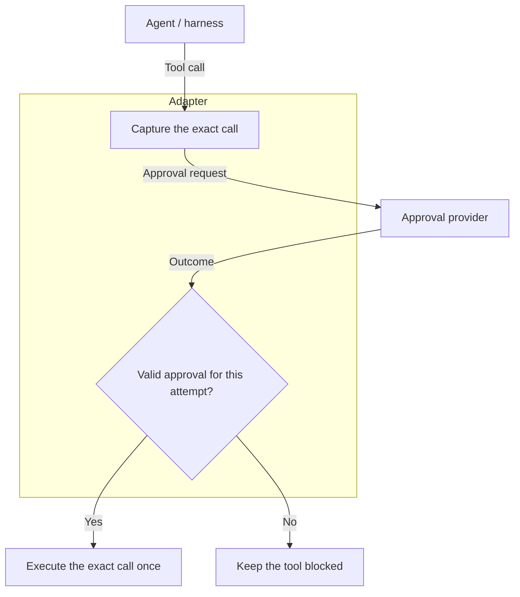

# Adapter

An adapter connects an agent's tool calls to an [approval provider](provider.md). It intercepts each call before it causes side effects, requests approval and enforces the outcome before allowing execution.

The agent continues to call tools through its harness. It receives the tool's result or an explanation of why the call did not run. The adapter handles the approval exchange on its behalf.

## Where the adapter runs

An adapter can be part of a harness, a tool hook or a gateway that controls access to tools. Its placement needs to let it hold a call before execution and prevent that call from running without valid approval.

An adapter can only control execution paths that pass through it. For example, blocking a payment tool does not prevent a separate shell command from making the same payment if the shell has the required credentials. A gateway that holds the service credentials can place approval at the point where access to that service is controlled.

See the specification's [enforcement limits](../specification/8_security.md#enforcement-limits) for more on this boundary.

## What the adapter does

The adapter captures the actual tool name and arguments, then submits them using an [instance credential](../specification/3_identity.md).

For example, if an agent proposes a refund, the adapter submits the payment ID, amount and currency from the intercepted call. Approval covers that exact refund and one execution attempt. Changing the amount requires a new request.

Before execution, the adapter validates the returned request and decision, checks that the outcome is `approved` and confirms that `decision.expires_at` has not passed. It keeps the approved arguments unchanged and tracks whether the call has already run, so retrieving the same approval again cannot repeat execution.

A pending request, denied outcome, invalid response or network failure does not permit execution. If execution is abandoned, the adapter attempts to cancel any pending request.

## Waiting for a decision

In [synchronous mode](../specification/6_sync.md), the adapter holds the tool call open and polls when the provider has not decided yet.

In [asynchronous mode](../specification/7_async.md), the harness saves execution state and suspends work. A receiving service verifies and durably records the provider's notification, then arranges for execution to resume. The adapter retrieves the authoritative decision and applies the same execution checks before allowing the saved call to run.

Read [the approval flow](approval-flow.md) to see these steps together, or the [adapter requirements](../specification/8_security.md#adapter-requirements) for the complete conformance rules.
