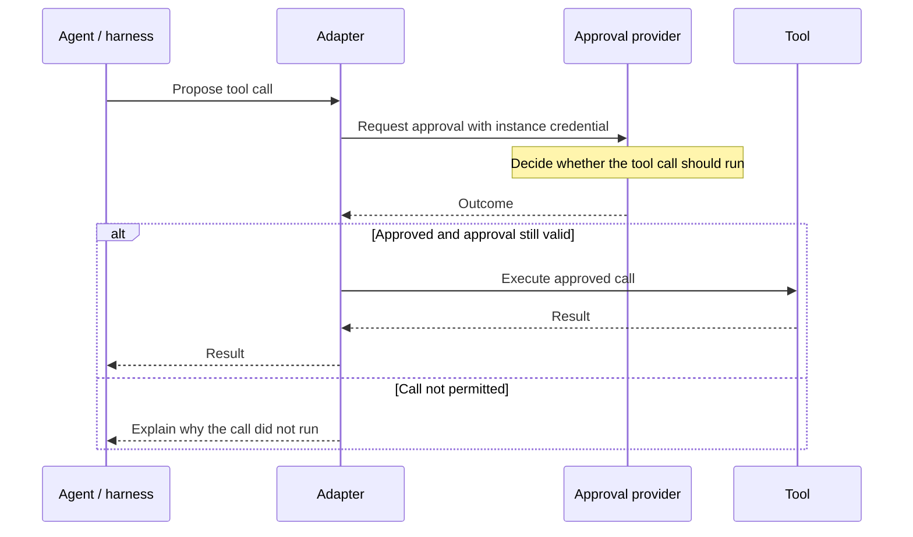

# The approval flow

AAP separates proposing an action, deciding whether it is allowed and executing it. The adapter connects these steps at the point where a tool would run.

## Tool call flow

1. The agent proposes a tool call through its harness.
2. The adapter captures the tool name and arguments before any side effects occur.
3. The adapter submits an approval request using its instance credential.
4. The provider records a decision, immediately or after review.
5. The adapter validates the result and either executes the approved call or reports why it did not run.

AAP is transparent to the underlying agent. It does not know that it exists.

## Instances and credentials

An instance identifies a particular running or installed agent. It can submit many approval requests over its lifetime.

A provisioner creates and manages instances. Each instance receives a credential that its adapter uses for approval requests. This keeps management access separate from the agent's approval traffic.

See [identity and authentication](../specification/3_identity.md) for the credential requirements.

## Modes

AAP aims to support approvals that take hours or longer. This is because approvals may involve a human review and humans can take a long time to respond to a request.
This naturally lends itself to an async architecture where if an agent is waiting for a request, it terminates and then is woken up when an approval is granted.
However, many existing harnesses expect a tool call to return its result before execution continues. Supporting suspension and resumption requires work from harness creators.
So to get the project moving without getting all harness providers to opt in, AAP has two modes: Asynchronous and Synchronous.

| Mode | How it works | Fits a harness that… |
| --- | --- | --- |
| Synchronous | The adapter keeps the call open and polls for a decision. | Can wait within the tool call's time limit. |
| Asynchronous | The adapter saves execution state, suspends work and resumes after a notification. | Can suspend and resume the same execution attempt. |

Both modes use the same request and decision objects. Start with synchronous mode when the harness can keep the call open long enough. Asynchronous mode also needs a durable receiver, signed webhook handling and coordination with suspended execution.

Read [synchronous mode](../specification/6_sync.md) and [asynchronous mode](../specification/7_async.md) for their complete contracts.

## Two different deadlines

`deadline_at` is the provider's deadline for reaching a decision. If it passes while the request is pending, the request becomes `expired`.

`decision.expires_at` is the deadline for starting an approved call. The adapter checks it immediately before execution. A request can still have an `approved` status after that permission has expired.

For example, a provider might have five minutes to review a refund, then grant two minutes to start it. Waiting for a decision and acting on that decision have different time limits.

## One approval, one attempt

Approval covers the submitted tool, its exact arguments and one execution attempt. Changing the arguments needs a new request. Retrying an HTTP request with the same idempotency key recovers the existing approval request; it does not grant another execution.

The adapter or harness tracks whether the tool has already run. An approval record alone cannot answer that question.

Read the normative [request lifecycle](../specification/4_requests.md) for the complete requirements.
