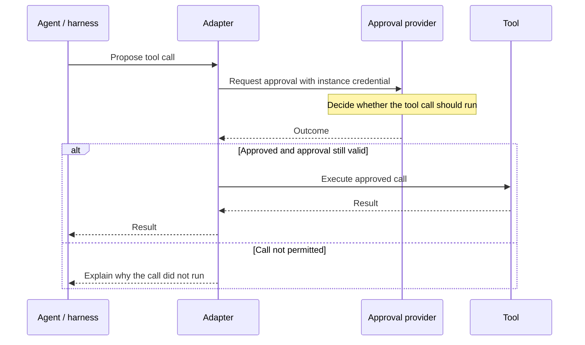

# The approval flow

AAP separates proposing an action, deciding whether it is allowed and executing it. The [adapter](adapter.md) connects these steps at the point where a tool would run, asking the [provider](provider.md) whether the call may proceed.

## Tool call flow

1. The agent proposes a tool call through its harness.
2. The adapter captures the tool name and arguments before any side effects occur.
3. The adapter submits an approval request using its instance credential.
4. The provider records a decision, immediately or after review.
5. The adapter validates the result and either executes the approved call or reports why it did not run.

AAP is transparent to the underlying agent. It does not know that it exists.

## Instances and credentials

An instance identifies a particular running or installed agent. It can submit many approval requests over its lifetime.

A provisioner creates and manages instances. Each instance receives a credential that its adapter uses for approval requests. This keeps management access separate from the agent's approval traffic.

See [identity and authentication](../specification/3_identity.md) for the credential requirements.

## Modes

Human review can take hours or longer. AAP supports two ways to wait for a decision, depending on whether the harness can suspend and resume execution.

| Mode | How it works | Fits a harness that… |
| --- | --- | --- |
| Synchronous | The adapter keeps the call open and polls for a decision. | Can wait within the tool call's time limit. |
| Asynchronous | The adapter saves execution state, suspends work and resumes after a notification. | Can suspend and resume the same execution attempt. |

Check your [adapter's guide](../adapters/overview.md) for its waiting behavior and time limits.

Read [synchronous mode](../specification/6_sync.md) and [asynchronous mode](../specification/7_async.md) for their complete contracts.
