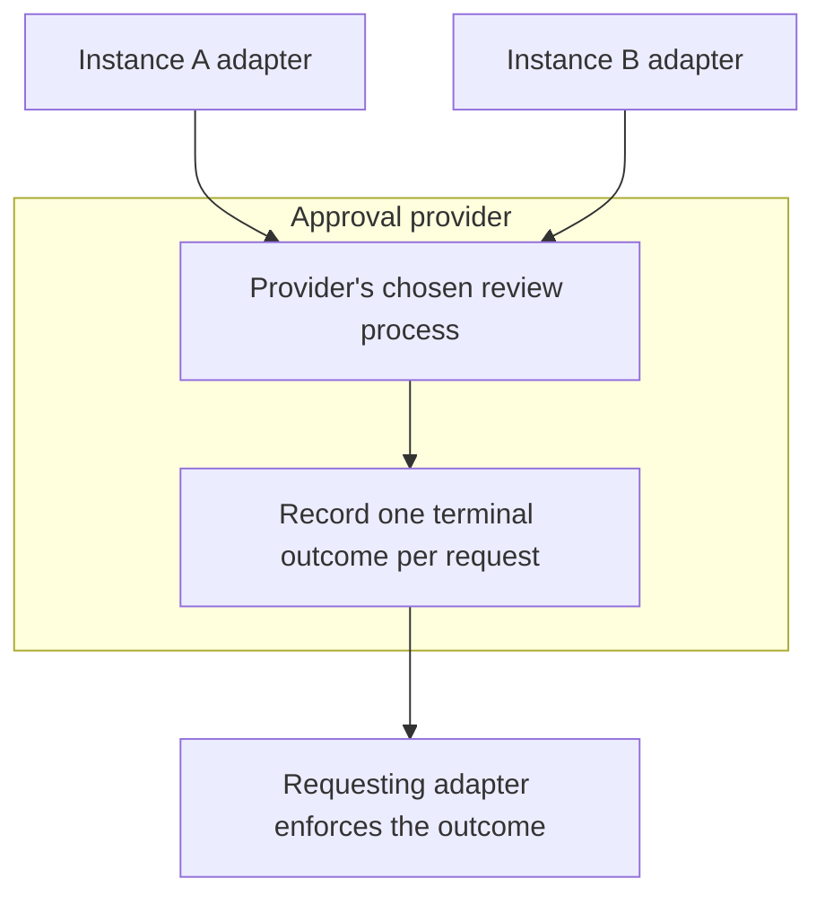

# Provider

An approval provider is the service that decides whether a proposed tool call may run. It receives requests from [adapters](adapter.md), records their outcomes and makes those outcomes available for enforcement.

A single provider can serve many agent instances across different harnesses. This gives a deployment one place to apply approval policies and review proposed actions.

## How decisions are made

AAP does not specify what a provider may do to get an approval, this is a choice to be made by the provider itself. This flexibility allows different AAP providers to cater to different needs.

For example, A provider can apply a policy automatically, ask a human to review the request or combine several steps. It might approve a routine lookup immediately and hold a refund for review.

AAP defines the request, the outcome and how they are exchanged. The provider chooses its review process and interface.

The provider records permission to execute. The adapter enforces that permission, and the harness or adapter tracks whether execution has happened.

## Instances and access

The provider assigns each [instance](../specification/3_identity.md) an identity and a credential. It derives the requesting instance's identity from that credential and authorizes access to its requests.

A separate provisioner token manages instances and their delivery configuration. This lets a platform create credentials for its agents without giving those agents instance management access.

## Recording an outcome

The provider preserves the submitted tool and arguments and records one terminal outcome for each request. A request can be `pending` whilst review continues, then become `approved`, `denied`, `expired` or `cancelled`.

Two deadlines serve different purposes. `deadline_at` limits the time available to decide. An approved decision's `expires_at` limits the time available to start the call. Reading an approval again does not extend its validity.

Retries with the same idempotency key recover the existing request. They do not create another approval or authorize another execution attempt. See [requests and decisions](../specification/4_requests.md) for the full lifecycle.

## Returning the result

Every provider supports request creation, retrieval, long polling and cancellation. It can return a decision immediately or let the adapter wait through [synchronous polling](../specification/6_sync.md).

A provider that supports [asynchronous mode](../specification/7_async.md) also verifies configured receivers and sends signed webhook notifications when requests reach a terminal outcome. The notification prompts the adapter to retrieve the decision through the authenticated API; it carries no permission to execute.

Read [the approval flow](approval-flow.md) to see how a provider and adapter work together, or the [provider requirements](../specification/8_security.md#provider-requirements) for the complete conformance rules.
