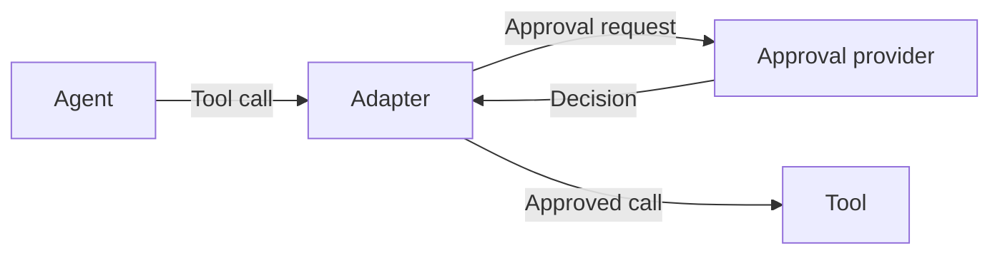

# What is Agent Approval Protocol (AAP)?

Agent Approval Protocol (AAP) is an open protocol for approving agent tool calls. It connects the system running an agent to an approval provider, so a proposed action can be reviewed before it happens.

For example, an agent helping a customer may propose a refund. An adapter intercepts that tool call and sends the exact payment and amount to an approval provider. The adapter waits for the outcome and only allows the refund when it has a valid approval.

## How it works

Three parts work together:

| Part | Responsibility |
| --- | --- |
| Agent | Proposes a tool call through its harness. |
| Adapter | Intercepts the call, requests approval and enforces the outcome. |
| Approval provider | Reviews the proposed call and records a decision. |

The provider can ask a human, apply a policy or combine several steps. AAP defines the exchange with the adapter; the provider chooses how review works.

## When to use AAP

Use AAP when an agent can propose actions that need approval before execution, such as issuing a refund, changing production settings or sending a message on someone's behalf.

The most common use case is to run all tool calls through AAP, and have the provider automatically approve benign requests whilst holding riskier ones for approval.
This gives you a centralized place to view all actions every agent has ever taken.

The benefit of using AAP is that of any shared standard. Any harness implementing AAP can use any approval provider and any approval provider implementing AAP will work with any harness that implements it.

## Start building

- Follow the [quickstart](quickstart.md) to submit a request and retrieve a decision.
- Read [the approval flow](../concepts/approval-flow.md) to understand identities, outcomes and execution modes.
- [Build an adapter](../guides/build-an-adapter.md) to connect an agent harness.
- [Build a provider](../guides/build-a-provider.md) to supply approval decisions.

## Read the specification

These docs explain how to work with AAP. The [specification](../specification/1_overview.md) defines version 1's protocol requirements, and the [OpenAPI contract](../../openapi.yaml) defines its HTTP operations and data types.

Use the Specification tab for the complete protocol and API reference.
