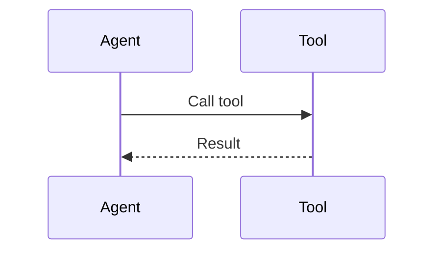
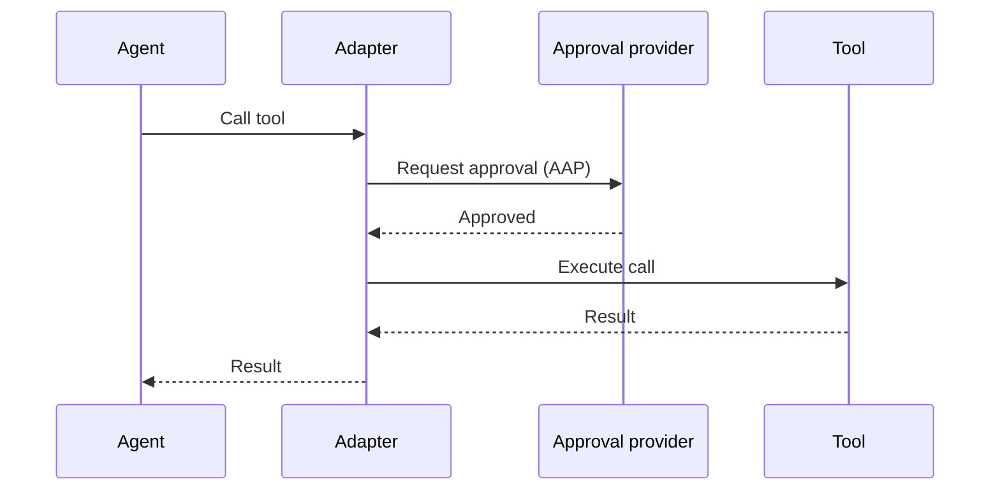
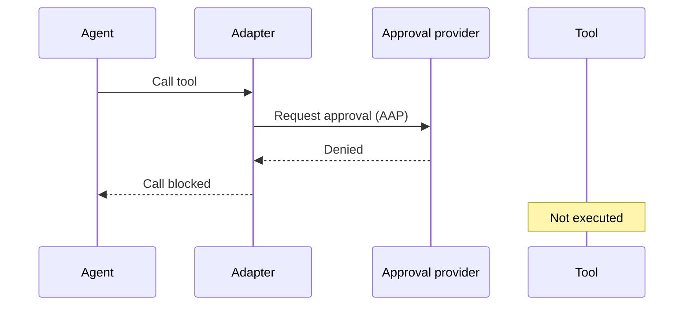

# Specification

Agents can finally do real work. They write code, answer customers, move tickets, touch production.
The bottleneck is no longer what they can do.
It is what we *let* them do.

The hesitation is earned.
Agents make mistakes, just like humans.
The answer is not to stop agents from taking consequential actions, the answer is to govern these actions.

[Agent Approval Protocol](https://agentapprovalprotocol.io) (AAP) is an open protocol that aims to allow governance of these actions.
Concretely, AAP allows agent tool calls to be gated behind an approval process.

This specification defines the protocol requirements for AAP version 1.

For guides and implementation advice, start with the [documentation](../getting-started/introduction.md).
For discussion on the protocol, queries and questions, head to [GitHub](https://github.com/agentapprovalprotocol).

## Design Goals

The main design goal of AAP is simplicity.
The protocol should be easy both to understand and implement.

The secondary design goal of AAP is to be pragmatic.
Where possible, we aim for the best solution, however the best solution can often require significant engineering work and re-architectures of existing systems.
For this reason, AAP supports two execution modes.
Synchronous mode works with harnesses that hold a tool call open whilst waiting for a result.
Asynchronous mode allows the harness to suspend execution and resume it later.

## Premise

The tool call is the point at which agents interact with the real world.
Therefore, this is the point at which AAP is implemented.

The premise of AAP is very simple: intercept tool calls and validate that the call is permitted to run before executing it.

The tool call cycle before AAP:

The tool call cycle after AAP for approved tools:

The tool call cycle after AAP for denied tools:

At a conceptual level that is the entire protocol.
Further sections will define exactly how this works in practice.

## Scope

AAP defines the exchange between an adapter and an approval provider.
It defines how a proposed tool call is described, how approval is requested and how the result is returned.

How the provider reaches a decision is up to the provider.
It may ask a human, evaluate a policy or combine several steps.
Reviewer interfaces, notifications to reviewers and approval workflows are outside the protocol.
Notifications to an adapter's receiving service are defined by the asynchronous delivery contract.

AAP does not execute tools.
The adapter enforces the decision at the point where the tool would run.
