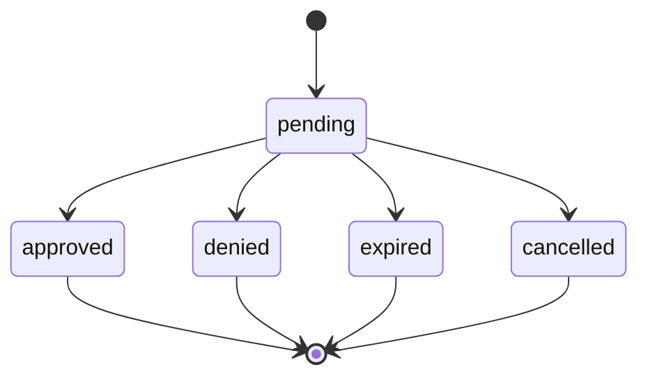

# Requests and Decisions

An approval request asks whether one proposed tool call may run.
It describes the tool and the arguments that will be passed to it.

The request does not execute the tool.
It gives the provider enough information to decide whether execution is permitted.

## Request

The adapter submits a `CreateApprovalRequest`, defined in the [OpenAPI schema](../../openapi.yaml).
It names the tool, supplies its arguments and requests a window in which to decide.
It can also include the agent's reasoning and context observed by the adapter.

For example:

```json
{
  "tool": "issue_refund",
  "arguments": {
    "payment_id": "payment_123",
    "amount": 4900,
    "currency": "GBP"
  },
  "timeout": "30m",
  "agent_reasoning": "The customer was charged twice.",
  "context": {
    "session_id": "session_456"
  }
}
```

The tool and arguments must come from the intercepted call.
They must not be replaced with the agent's description of what it intends to do.

The provider may use `agent_reasoning` to help a reviewer understand the request.
However, it is a claim from the agent and must be presented as such.

`context` is information collected by the adapter.

## Request Resource

The provider returns an `ApprovalRequest`, defined in the [OpenAPI schema](../../openapi.yaml).
It contains the submitted call, a provider-assigned ID, the current state and the approval deadline.
Once the request is terminal, it also contains the decision.

The request ID identifies the same request throughout its lifetime.

## States

A request has one of five states:

| State | Meaning | May the call run? |
| --- | --- | --- |
| `pending` | The provider has not recorded an outcome. | No. |
| `approved` | The provider permits the call. | Only before `decision.expires_at`. |
| `denied` | The provider refused the call. | No. |
| `expired` | The approval window ended without a decision. | No. |
| `cancelled` | The request was withdrawn or its instance was deleted. | No. |



The final four states are terminal.
A terminal request must not change state.
Each request receives exactly one terminal outcome.

A provider may decide immediately when the request is created.
The adapter may therefore receive a terminal request without ever observing `pending`.

## Decision

Once a request is terminal, its `decision` contains the outcome.
The `Decision` object is defined in the [OpenAPI schema](../../openapi.yaml).

For example:

```json
{
  "status": "approved",
  "note": "The duplicate charge has been confirmed.",
  "decided_at": "2026-09-16T12:02:00Z",
  "expires_at": "2026-09-16T12:07:00Z"
}
```

The decision's status must match the request's status.

An approved decision must include `expires_at`.
The provider sets this to the time at which permission to start the call ends.
It must be later than `decided_at`.
The validity period is up to the provider.
Other outcomes do not include `expires_at`.

A note gives the agent additional information.
It does not change the approved arguments or grant permission for other calls.

## Deadlines and Cancellation

The adapter requests an approval window through `timeout`.
The provider sets `deadline_at` when it accepts the request.
It may shorten the requested window to meet its own limits, but must not lengthen it.

If the request is still pending at its deadline, the provider records `expired`.
It must not approve a pending request after that deadline.

Every provider must support cancellation.
The requesting instance can withdraw a pending request when execution is abandoned.
Deleting an instance also cancels all of its pending requests.
If a decision, cancellation and expiry race, the provider must record only one terminal outcome.

## Execution

An approval applies to exactly one submitted tool, arguments and execution attempt.
If the proposed call changes, the adapter must request approval again.

Receiving the same approval twice must not cause the tool to run twice.
The harness or adapter must track whether the call has already executed.

The deadline limits how long the provider may take to decide.

`decision.expires_at` limits how long the adapter has to start an approved call.
The adapter must check this time immediately before allowing execution.
At or after `expires_at`, the call must not start using that approval.
A call that has already started may finish after this time.

The recorded request remains `approved` after its permission expires.
The `expired` request state means that no decision was reached before `deadline_at`.

Reading the decision again or replaying the original request does not extend `expires_at`.
If a new execution attempt is needed after expiry, it requires a new approval request and idempotency key.
