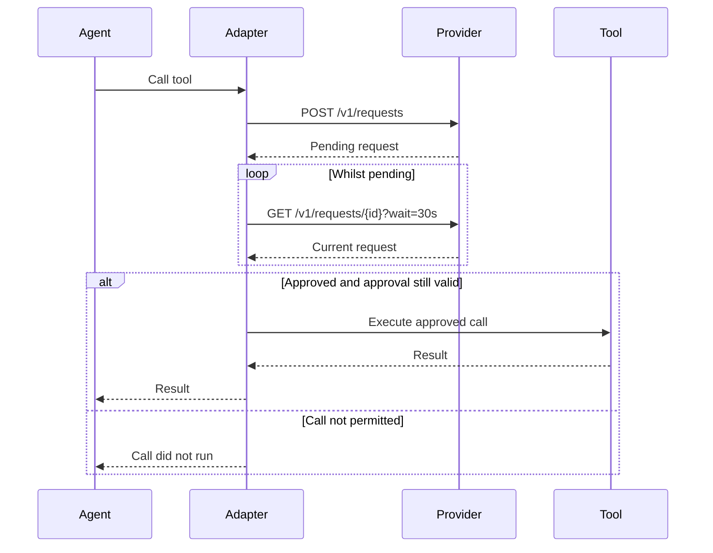

# Synchronous Mode

In synchronous mode, the adapter holds the intercepted tool call open whilst waiting for approval.
It submits an approval request to the provider, then polls until the request reaches a terminal state.

If approved and the approval is still valid, the adapter allows the tool call to execute.
Otherwise, it returns the outcome without executing the call.

## Flow

1. The agent makes a tool call.
2. The adapter intercepts the call and submits an approval request.
3. If the returned request is pending, the adapter polls for a decision.
4. Once a decision is available, the adapter applies it to the intercepted call.
5. The agent receives the tool result or an explanation of why the call did not run.



The provider may return a terminal decision in the response to the initial request.
In that case, the adapter applies the decision immediately and does not poll.

For every approved decision, the adapter must check `decision.expires_at` immediately before allowing the call to start.
This also applies to approvals recovered through a retry.
If the approval is no longer valid, the adapter reports that it expired without executing the call.

## HTTP Example

This example uses `https://approvals.example.com` as the provider's base URL.
The instance has already been [provisioned](5_http.md#provision-an-instance).
The adapter submits the intercepted refund call:

```http
POST /v1/requests HTTP/1.1
Host: approvals.example.com
Authorization: Bearer <instance_credential>
Content-Type: application/json
Idempotency-Key: 4dc635f0-9423-4a98-99cc-33d2168fcbb2

{
  "tool": "issue_refund",
  "arguments": {
    "payment_id": "payment_123",
    "amount": 4900,
    "currency": "GBP"
  },
  "timeout": "30m"
}
```

The provider creates the approval request:

```http
HTTP/1.1 201 Created
Content-Type: application/json
X-Request-ID: 1184dfc5-0e86-4f88-9b68-882b1dc60467

{
  "id": "7ab8c8ec-7b2d-4fd6-9b52-752f9515eb71",
  "tool": "issue_refund",
  "arguments": {
    "payment_id": "payment_123",
    "amount": 4900,
    "currency": "GBP"
  },
  "timeout": "30m",
  "status": "pending",
  "created_at": "2026-09-16T12:00:00Z",
  "deadline_at": "2026-09-16T12:30:00Z"
}
```

The adapter keeps the tool call open and polls for up to 30 seconds:

```http
GET /v1/requests/7ab8c8ec-7b2d-4fd6-9b52-752f9515eb71?wait=30s HTTP/1.1
Host: approvals.example.com
Authorization: Bearer <instance_credential>
```

If no decision arrives during that wait, the provider returns the pending request:

```http
HTTP/1.1 200 OK
Content-Type: application/json
X-Request-ID: 52c40c61-f6c4-4b15-82f0-2184bb3d8df1

{
  "id": "7ab8c8ec-7b2d-4fd6-9b52-752f9515eb71",
  "tool": "issue_refund",
  "arguments": {
    "payment_id": "payment_123",
    "amount": 4900,
    "currency": "GBP"
  },
  "timeout": "30m",
  "status": "pending",
  "created_at": "2026-09-16T12:00:00Z",
  "deadline_at": "2026-09-16T12:30:00Z"
}
```

The adapter repeats the same GET whilst the request is pending:

```http
GET /v1/requests/7ab8c8ec-7b2d-4fd6-9b52-752f9515eb71?wait=30s HTTP/1.1
Host: approvals.example.com
Authorization: Bearer <instance_credential>
```

After several polls, a decision is recorded at `12:02:00Z`.
The poll in progress returns:

```http
HTTP/1.1 200 OK
Content-Type: application/json
X-Request-ID: 85f21849-8387-4b67-a7ef-251cc4fcb67a

{
  "id": "7ab8c8ec-7b2d-4fd6-9b52-752f9515eb71",
  "tool": "issue_refund",
  "arguments": {
    "payment_id": "payment_123",
    "amount": 4900,
    "currency": "GBP"
  },
  "timeout": "30m",
  "status": "approved",
  "created_at": "2026-09-16T12:00:00Z",
  "deadline_at": "2026-09-16T12:30:00Z",
  "decision": {
    "status": "approved",
    "note": "The duplicate charge has been confirmed.",
    "decided_at": "2026-09-16T12:02:00Z",
    "expires_at": "2026-09-16T12:07:00Z"
  }
}
```

The adapter checks `decision.expires_at` immediately before starting the approved call.
In this example, the call must start before `12:07:00Z`.
It then returns the tool's result to the agent.
If approval has expired or the outcome does not permit execution, the tool does not run.

## Polling

Each poll retrieves the same approval request.
It does not create a new one or extend its deadline.

The adapter should use the HTTP API's [long polling](5_http.md#retrieve-a-request) support to avoid repeatedly requesting an unchanged result.
A completed poll may still return `pending`.
The adapter then polls again.

A connection timeout does not mean the approval request expired.
The adapter can retry the read whilst the tool call is still waiting.

## Waiting Limits

The adapter needs to know how long the harness will allow the tool call to wait.
The requested approval timeout must fit within that limit, leaving time to receive the result and return it to the harness.

The provider's `deadline_at` describes the approval window.
The adapter should allow a short margin to retrieve the provider's final state, provided that margin fits within the harness's limit.

If the adapter reaches its own limit without a valid decision, the call must not run.
It reports that approval could not be obtained.
It must not claim that a human denied the request.

## Interruptions

If execution is abandoned, the adapter must attempt to cancel the pending request.
This prevents a person from reviewing a call that nobody is waiting to execute.

A lost HTTP response alone does not mean execution has been abandoned.
The adapter can recover the same request using the retry rules in the [HTTP API](5_http.md#idempotency-and-retries).

Recovering an approved request is only enough to continue if the harness knows the tool has not already run.
An approval record does not record tool execution.
