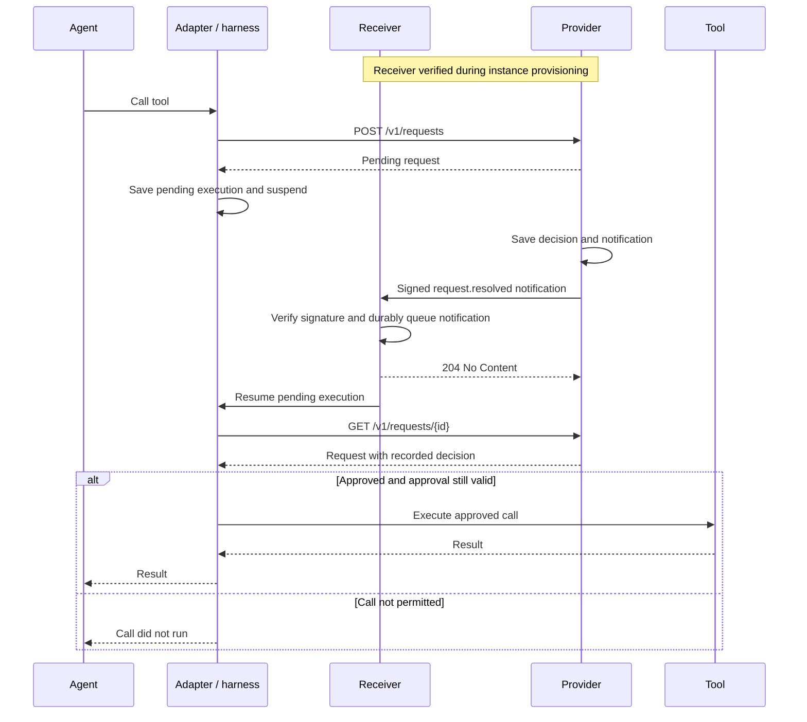

# Asynchronous Mode

In asynchronous mode, the harness can suspend execution whilst waiting for approval.
It saves enough state to resume the intercepted tool call once a decision is available.

The agent process does not need to remain running during this time.
This allows approvals to outlive a process or a network connection.

AAP version 1 uses webhooks for delivery.
A provider supporting asynchronous mode must support webhooks.
The event is independent of the transport so a future socket mode can carry the same notification.
Socket connections, authentication and acknowledgements are not defined here.

## Delivery Configuration

The provisioner configures delivery when creating or updating an [instance](3_identity.md).
It supplies a `delivery` object with `type: webhook`, an HTTPS `url`, a `registration_id` and a shared `signing_secret`.
An instance without delivery configuration can use synchronous mode.

The secret contains 32 cryptographically random bytes, encoded as padded base64 with a `whsec_` prefix.
Use a separate secret for each instance.
It must not be an instance credential or provisioner token.

The provisioner generates the registration ID as a UUID and associates it with the secret on the receiving service.
The receiving service must already have this association and expect the registration.
The registration ID lets it select the secret before it knows the provider's instance ID.
Reuse the registration ID when retrying the same submission; prepare a new one when replacing delivery configuration.
The provider never returns the secret, and the agent must not receive it.
Instance responses expose the receiver's type, URL and registration ID.
Approval requests inherit the instance's delivery configuration and cannot supply a destination or secret.

The receiver must be reachable by the provider and remain available whilst the agent process is stopped.
It may be part of the harness or a separate service.

### Registration Example

A harness receives webhooks for several instances at `https://harness.example.com/aap/events`.
Before creating an instance, the provisioner generates registration ID `8246931c-4ce0-4c15-a94a-e9c078ad06e2` and a signing secret.
It stores their association on the receiver, then submits:

```http
POST /v1/instances HTTP/1.1
Authorization: Bearer <provisioner_token>
Content-Type: application/json
Idempotency-Key: 673214be-26e4-44b2-8ef6-321df40fd265

{
  "instance_name": "codex-chris-laptop",
  "delivery": {
    "type": "webhook",
    "url": "https://harness.example.com/aap/events",
    "registration_id": "8246931c-4ce0-4c15-a94a-e9c078ad06e2",
    "signing_secret": "whsec_AAECAwQFBgcICQoLDA0ODxAREhMUFRYXGBkaGxwdHh8="
  }
}
```

The example secret is illustrative. A deployment must generate its own random secret.
The provider sends the verification message below to the shared URL before returning the instance credential.
The receiver uses `registration_id` to look up the secret and verifies the signature against the original body bytes.
Only then does it associate the proposed `instance_id` with this registration and return the challenge.

After successful verification, the provider returns `201 Created` with the instance and its credential.
Ordinary notifications contain `instance_id`, which the receiver can now use to select the secret.
They do not need a registration ID, so their bodies stay unchanged when delivery configuration is replaced.

## Receiver Verification

Before creating an instance or replacing its delivery configuration, the provider sends a signed `WebhookVerification` to the proposed URL:

```json
{
  "id": "c9bb5281-f9a5-4660-b27e-0b1cbbad81b6",
  "type": "webhook.verification",
  "registration_id": "8246931c-4ce0-4c15-a94a-e9c078ad06e2",
  "instance_id": "b29a43a7-1949-4b9f-9d61-b7ae66f85d31",
  "created_at": "2026-09-16T11:59:00Z",
  "challenge": "2edc34d7-cc57-44b1-8705-2fa608d3224a"
}
```

The provider generates a fresh unpredictable challenge for this configuration attempt.

The receiver verifies the signature and checks that it expects this registration before returning `200 OK` with:

```json
{
  "challenge": "2edc34d7-cc57-44b1-8705-2fa608d3224a"
}
```

The challenge must match exactly and the response must arrive within ten seconds.
A bare `200` or a different `2xx` is not sufficient.
Receivers must not automatically accept every registration from a recognized provider.

Verification makes one attempt per creation or update attempt and does not use the notification retry schedule.
Failure returns `422` with code `webhook_verification_failed` to the provisioner.
No instance is created or credential issued on a failed creation.
A failed update leaves the existing configuration and name unchanged.
The provisioner may retry with the same idempotency key and input, subject to registration limits.

## Updating and Removing Delivery

The provisioner replaces delivery configuration through `PATCH /v1/instances/{id}`.
It supplies the complete `delivery` object, including the URL, a new registration ID and the signing secret.
This also applies when rotating the secret without changing the URL.
Omitting `delivery` leaves it unchanged; setting it to `null` removes the receiver and ends outstanding delivery and retries.

The provider verifies a replacement before committing any part of the update.
The old configuration remains active until verification succeeds and the update commits.
A failed verification leaves the existing configuration and name unchanged.
Removing delivery or changing only the name does not require verification.

After a successful replacement, queued notifications and future attempts use the new URL and secret, including notifications for older requests.
Their IDs, bodies and retry deadlines stay unchanged.
Completed deliveries are not replayed, and requests that became terminal without a receiver do not gain notifications.

Attempts already in flight may reach and be acknowledged by the old receiver.
The provisioner must coordinate the receiving services and their saved execution state during a move.

Deleting the instance ends delivery and retries and cancels its pending approval requests without sending cancellation notifications.
Attempts already in flight when delivery is removed or the instance is deleted may still arrive.
The [HTTP API](5_http.md#update-an-instance) defines the update and deletion responses and their retry behavior.

## Notification

When a request becomes `approved`, `denied`, `expired` or `cancelled`, the provider records one `RequestResolvedEvent` if delivery is configured:

```json
{
  "id": "f4b96ac4-404d-4f6a-9a03-a0565edc4922",
  "type": "request.resolved",
  "instance_id": "b29a43a7-1949-4b9f-9d61-b7ae66f85d31",
  "request_id": "7ab8c8ec-7b2d-4fd6-9b52-752f9515eb71",
  "created_at": "2026-09-16T12:02:00Z"
}
```

`created_at` equals the decision's `decided_at`.
The event carries no outcome, tool arguments, credentials or permission to execute.
The receiver uses the request ID to arrange an authenticated read from its configured provider.

The provider must durably record the decision and notification together so a restart cannot lose the notification.
This includes decisions made during request creation and ordinary request cancellation.
Replaying a request or reading its state does not create another event.
Deleting an instance cancels its pending requests without generating notifications and ends its outstanding deliveries.

The event ID and body remain unchanged across retries and receiver updates.
Adding a receiver does not generate events for requests that were already terminal without one.
No ordering is guaranteed between notifications for different requests.

The [OpenAPI schema](../../openapi.yaml) defines the event, verification objects and receiver operations.


## Flow

1. The agent makes a tool call.
2. The adapter intercepts the call and submits an approval request.
3. If the request is pending, the harness saves the pending execution and suspends it.
4. The provider records a terminal outcome and sends an event to the adapter's receiving service.
5. The receiving service identifies the pending execution and arranges for it to resume.
6. The adapter retrieves the request and applies the recorded decision before the tool can run.



If the initial submission already returns a terminal request, there is no need to suspend execution.

## HTTP Example

This example uses the instance and receiver from the [registration example](#registration-example).
The provider's base URL is `https://approvals.example.com`.
The adapter submits the intercepted refund call:

```http
POST /v1/requests HTTP/1.1
Host: approvals.example.com
Authorization: Bearer <instance_credential>
Content-Type: application/json
Idempotency-Key: 4dc635f0-9423-4a98-99cc-33d2168fcbb2

{
  "tool": "issue_refund",
  "arguments": {
    "payment_id": "payment_123",
    "amount": 4900,
    "currency": "GBP"
  },
  "timeout": "30m"
}
```

The provider creates the approval request:

```http
HTTP/1.1 201 Created
Content-Type: application/json
X-Request-ID: 1184dfc5-0e86-4f88-9b68-882b1dc60467

{
  "id": "7ab8c8ec-7b2d-4fd6-9b52-752f9515eb71",
  "tool": "issue_refund",
  "arguments": {
    "payment_id": "payment_123",
    "amount": 4900,
    "currency": "GBP"
  },
  "timeout": "30m",
  "status": "pending",
  "created_at": "2026-09-16T12:00:00Z",
  "deadline_at": "2026-09-16T12:30:00Z"
}
```

The harness saves the request ID, idempotency key and exact tool call, then suspends execution.

When the provider records a decision, it sends a notification to the instance's receiver.
The delivery timestamp is `2026-09-16T12:02:01Z`.

```http
POST /aap/events HTTP/1.1
Host: harness.example.com
Content-Type: application/json
webhook-id: f4b96ac4-404d-4f6a-9a03-a0565edc4922
webhook-timestamp: 1789560121
webhook-signature: v1,zgT2qt+QiEEonu9tmZqEuKzoa83SGE9ZcCgUHzqSPZ8=

{
  "id": "f4b96ac4-404d-4f6a-9a03-a0565edc4922",
  "type": "request.resolved",
  "instance_id": "b29a43a7-1949-4b9f-9d61-b7ae66f85d31",
  "request_id": "7ab8c8ec-7b2d-4fd6-9b52-752f9515eb71",
  "created_at": "2026-09-16T12:02:00Z"
}
```

The receiver verifies the signature and durably queues the notification before acknowledging it:

```http
HTTP/1.1 204 No Content
```

The receiver arranges for the harness to resume.
The adapter retrieves the request using its instance credential:

```http
GET /v1/requests/7ab8c8ec-7b2d-4fd6-9b52-752f9515eb71 HTTP/1.1
Host: approvals.example.com
Authorization: Bearer <instance_credential>
```

The provider returns the request with its recorded decision:

```http
HTTP/1.1 200 OK
Content-Type: application/json
X-Request-ID: 7cd364ac-c68d-477c-b3ad-433b5db1c7d9

{
  "id": "7ab8c8ec-7b2d-4fd6-9b52-752f9515eb71",
  "tool": "issue_refund",
  "arguments": {
    "payment_id": "payment_123",
    "amount": 4900,
    "currency": "GBP"
  },
  "timeout": "30m",
  "status": "approved",
  "created_at": "2026-09-16T12:00:00Z",
  "deadline_at": "2026-09-16T12:30:00Z",
  "decision": {
    "status": "approved",
    "note": "The duplicate charge has been confirmed.",
    "decided_at": "2026-09-16T12:02:00Z",
    "expires_at": "2026-09-16T12:07:00Z"
  }
}
```

The adapter checks `decision.expires_at` immediately before starting the saved call.
In this example, the call must start before `12:07:00Z`.
It executes the call once and returns the result to the agent.
If approval has expired or the outcome does not permit execution, the tool does not run.

If the notification is delivered again, the receiver acknowledges it without scheduling another execution.

## Signing

Both messages use HTTPS `POST` with `Content-Type: application/json` and [Standard Webhooks' HMAC-SHA256 scheme](https://github.com/standard-webhooks/standard-webhooks/blob/main/spec/standard-webhooks.md#verifying-webhook-authenticity).

The required headers are:

| Header | Value |
| --- | --- |
| `webhook-id` | The message's `id`. |
| `webhook-timestamp` | The delivery attempt time in Unix seconds. |
| `webhook-signature` | `v1,` followed by the base64 HMAC digest. |

Remove `whsec_` and base64-decode the configured secret to obtain the signing key.
Sign `webhook-id`, `.`, `webhook-timestamp`, `.` and the exact transmitted body bytes, in that order.
Use UTF-8 for the header values and separators.
Do not parse and reserialize JSON before verification.
The header may contain space-separated signatures; a valid `v1` signature is required.

The receiver uses its configured secret, compares signatures in constant time and rejects timestamps more than five minutes from its clock.
It must also check that the body ID matches `webhook-id`.
Verification binds the proposed instance ID to an expected registration; later notifications must match that instance.
Providers and receivers must keep their clocks synchronized.

Each retry has a fresh attempt timestamp and signature; the event's `created_at` stays fixed.
The provider sends neither instance credentials nor provisioner tokens to the receiver.

## Acknowledgements and Retries

The receiver verifies a notification and durably saves or queues it before returning any `2xx` response.
`204 No Content` is a suitable acknowledgement.
Acknowledgement confirms receipt, not completion of the tool call.
The provider ignores the response body.
An already saved duplicate must also receive `2xx` without scheduling another execution.

The provider attempts delivery promptly and retries failures with exponential backoff and jitter for up to seven days (168 hours) after `decision.decided_at`.
It stops once a delivery is acknowledged.
There must be at most one outstanding attempt per event.
Each attempt has a timeout of at most ten seconds and must end by the retry deadline.
Connection failures, timeouts and non-`2xx` responses are delivery failures.
The provider must not follow redirects.
It must respect `Retry-After` on `429` and `503` responses without extending the retry window.

Approval expiry does not stop notification delivery.
The receiver still needs to learn that the request has reached a terminal outcome.
An expired approval must not be used to execute the call.

The provider retains the request, its idempotency key and notification until the later of seven days after the decision or 24 hours after delivery is acknowledged or retries end.
If an attempt remains in flight when delivery is removed, the grace period starts after that attempt finishes.
The [HTTP retention rules](5_http.md#retention) also apply when delivery fails.

## Resuming Execution

The harness needs to retain the approval request ID, the original idempotency key and the exact pending tool call.

The event tells the receiver that a decision is available.
The adapter must retrieve the current request from the provider before applying it.
The event alone does not authorize execution.

The approval may expire whilst execution is suspended or an event is being delivered.
The adapter must check `decision.expires_at` immediately before allowing the approved call to start.
If that time has passed, the call must not run using the old approval.

A decision may arrive before the harness finishes suspending execution.
The receiver must retain it so that the wake-up is not lost.

The same event may also arrive more than once.
Repeated delivery must not resume the same tool call more than once or cause repeated execution.
The receiver must retain duplicate tracking through the retry window and delivery grace period.
Keeping event IDs for at least eight days after `created_at` covers both.
The harness must also remember whether execution has already started or been abandoned.
It must acknowledge and discard a valid notification for abandoned execution without resuming it.

## Recovery

If an event is missed, the harness can retrieve its pending approval requests by their saved IDs.
A provider retains the decision for the [required retention period](5_http.md#retention), regardless of whether event delivery succeeded.
Reading it still requires a valid credential; retention does not preserve access after instance deletion.

If execution has been abandoned, the adapter must attempt to cancel the pending request.
Putting execution to sleep is not abandonment and must not cancel it.

## Abuse Prevention

A signing secret authenticates a message but does not prove that a destination has agreed to receive traffic.
The provider must complete receiver verification before sending notifications to a new destination.
Verification must be bound to the exact URL and proposed configuration.

Providers must limit registration attempts, approval creation, delivery rates and concurrency per provisioning account and destination, across instances.
Limits must cover verification traffic and retries as well as first delivery attempts.
Changing URL paths or creating more instances must not bypass destination limits; providers must also bound aggregate traffic to destination hosts and addresses.
Request and response sizes must be bounded.
Numerical limits are provider policy and must be documented.

Before every outbound connection, the provider must validate the URL and resolved addresses, including for verification and retries.
URLs must use HTTPS and must not contain userinfo or fragments.
Reject loopback, private, link-local, cloud metadata and other non-public addresses, including IPv6.
The actual connection must use an address that passed these checks, so a DNS change cannot bypass validation.
Redirects must not be followed.

These checks follow [OWASP's SSRF prevention guidance](https://cheatsheetseries.owasp.org/cheatsheets/Server_Side_Request_Forgery_Prevention_Cheat_Sheet.html).
They must also apply to traffic sent while a webhook is being verified.
