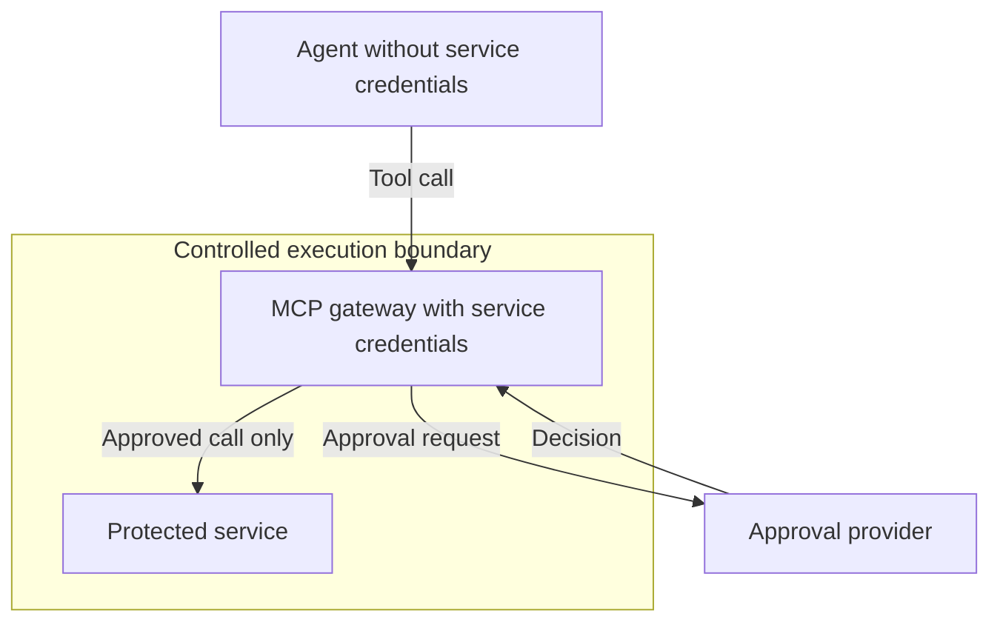
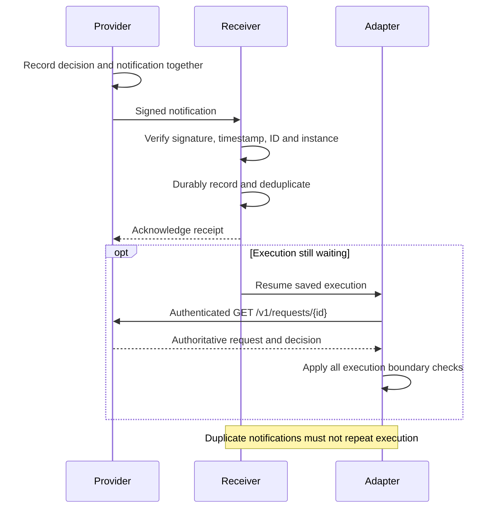

# Security and Conformance

AAP provides a decision about whether a tool call may run.
That decision is useful only if the adapter enforces it at the execution boundary.

In this specification, "must" describes a requirement.
"Should" describes a recommendation whose tradeoffs an implementation needs to consider.

## Execution Boundary

The adapter must intercept the call before it causes side effects.
Only a valid `approved` result for that request permits execution, and the call must start before `decision.expires_at`.

A pending request, an unknown status, an invalid response or a network failure must not permit the call to run.
The adapter must validate that the returned request ID and decision match the request it is waiting for.

The tool and arguments that run must be the ones submitted for approval.
The adapter must prevent later middleware or agent output from changing them after approval.

Approval applies to that execution attempt.
It must not become a general permission to invoke the same tool again.

## Trust

The provider authenticates the requesting instance through its credential only.
Agent-supplied text and request metadata must not override that identity.

Agent reasoning can contain instructions or misleading text.
A provider must treat them as material to review, not instructions that change its approval rules.

Credentials must be protected in storage and transport.
They must not appear in tool arguments, URLs, logs or error messages.

The provisioner controls instance management and delivery configuration.
Instance credentials must not permit these operations.
Webhook signing secrets must remain with the trusted provisioner, provider and receiving service.
They must not be returned by instance reads, exposed to the agent or reused as API credentials.

A valid webhook signature proves the sender knows the configured secret.
It does not authorize tool execution or prove that the receiver consented to registration.
Receivers must verify expected registrations and fetch decisions through the authenticated API.
Providers must apply the [webhook abuse controls](7_async.md#abuse-prevention) to verification and delivery.

Tool arguments may themselves contain sensitive information.
An adapter must not silently remove or replace arguments whilst claiming that the submitted payload is the complete call.
Open question: whether AAP needs a standard way to represent redacted arguments and what an approval of such a request means.

## Enforcement Limits

An adapter can enforce approval for calls that pass through it.
It cannot prevent the agent from using another execution path that it does not control.

For example, a hook that blocks a payment tool cannot stop a separate shell command from making the same payment if the shell has access to the necessary credentials.

Deployments that require this guarantee must place the approval boundary where access to the protected operation is controlled.
The protocol does not create that boundary by itself.

For example, service credentials can be held by a remote MCP gateway.
The agent accesses tools through the gateway and never receives the credentials.
For every tool call, the gateway requests approval from the AAP provider.

This ensures that the agent has no execution sidepath to exploit.

In this deployment, the gateway holds the service credentials and enforces approval before accessing the protected service:

## Adapter Requirements

A conforming synchronous adapter must:

1. Authenticate as an instance and submit the intercepted tool call accurately.
2. Retain the same idempotency key when recovering the same request.
3. Handle both immediate decisions and requests that require polling.
4. Enforce the terminal outcome, check approval validity immediately before execution and keep the approved arguments unchanged.
5. Prevent execution when no valid approval has been obtained.
6. Distinguish a denial from expiry, cancellation or failure to obtain a decision.
7. Avoid executing a call again when the same approval is retrieved more than once.
8. Attempt to cancel pending requests when execution is abandoned.

## Provider Requirements

A conforming provider must:

1. Authenticate credentials and authorize access to requests.
2. Support request creation, retrieval, long polling and cancellation.
3. Preserve request identity across retries and reject conflicting reuse of an idempotency key.
4. Record only one terminal outcome for each request.
5. Expire requests that remain pending at their deadline.
6. Return consistent request and decision states using the [OpenAPI contract](../../openapi.yaml).
7. Keep the tool and arguments immutable after accepting a request.
8. Support instance creation, retrieval, updates and deletion within the provisioner token's scope, and return an instance-bound credential on creation.
9. Retain approval requests, instance operation results and their idempotency keys for the [required periods](5_http.md#retention).
10. Set a fixed `expires_at` later than `decided_at` on every approved decision and preserve it across reads and retries.
11. Revoke credentials, cancel pending requests and stop delivery when an instance is deleted, without changing existing terminal outcomes.
12. Make instance updates and deletion safe to retry without restoring a deleted instance or overwriting a later update.

## Asynchronous Requirements

An asynchronous provider must also:

1. Support instance-level webhook configuration and verify the receiver before creating an instance or replacing its configuration.
2. Leave creation or an update uncommitted when verification fails, and never return the signing secret.
3. Durably record a notification with each terminal decision when delivery is configured, except during instance deletion.
4. Sign verification messages and notifications, preserving event IDs and bodies across retries.
5. Retry failed notifications for the seven-day window, respect acknowledgements and rate limits, and enforce bounded attempts.
6. Move queued notifications to a verified replacement receiver without restarting the retry window or replaying completed delivery.
7. Apply the additional 24-hour delivery grace period to request, idempotency and notification retention.
8. Verify receiver consent and enforce the destination, registration and traffic restrictions in the asynchronous contract.

An asynchronous adapter and its receiving service must meet the shared identity, execution and cancellation requirements above and must also:

1. Keep the receiver available whilst execution is suspended and protect the signing secret from the agent.
2. Verify signatures, delivery timestamps, message IDs and the expected instance before accepting messages.
3. Accept verification challenges only for expected registrations.
4. Acknowledge notifications only after durable receipt, and handle duplicates without repeating execution.
5. Save enough execution state to handle a notification arriving before suspension finishes.
6. Retrieve the authoritative request and check approval expiry before execution starts.
7. Discard notifications for abandoned execution and retain duplicate tracking through the retry window and grace period.

The notification prompts an authenticated read of the decision.
Only the adapter's execution checks can permit the saved call to run:

