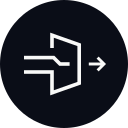
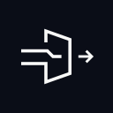
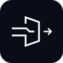
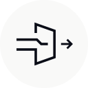
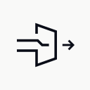
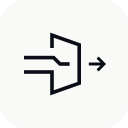

# AAP brand assets

The AAP symbol shows two agent flows entering an angular approval gate and one approved output. The lowercase wordmark uses outlined Roboto Mono Light glyphs with optical spacing. Its lighter strokes and smaller size balance the symbol, with the letter bodies optically centered on the output arrow.

| Files | Use |
| --- | --- |
| `aap-lockup-light.svg` / `.png` | Full logo for light surfaces |
| `aap-lockup-dark.svg` / `.png` | Full logo for dark surfaces |
| `aap-mark-light.svg` / `.png` | Standalone symbol for light surfaces |
| `aap-mark-dark.svg` / `.png` | Standalone symbol for dark surfaces |
| `aap-badge-circle-light.svg` / `.png` | Circle badge for light surfaces |
| `aap-badge-circle-dark.svg` / `.png` | Circle badge for dark surfaces |
| `aap-badge-square-light.svg` / `.png` | Square badge for light surfaces |
| `aap-badge-square-dark.svg` / `.png` | Square badge for dark surfaces |
| `aap-badge-rounded-square-light.svg` / `.png` | Rounded square badge for light surfaces |
| `aap-badge-rounded-square-dark.svg` / `.png` | Rounded square badge for dark surfaces |

The lockup and standalone mark have transparent backgrounds. Badges have a solid shape behind the mark, with transparency outside the shape. SVGs contain only vector artwork, with no embedded fonts or external dependencies. PNGs are convenience exports; badge PNGs are 1024 × 1024 px.

Use onyx (`#0a0d17`) on light surfaces and porcelain (`#f9f9f8`) on dark surfaces. Keep at least the arrow length of clear space around the symbol, and display the standalone mark at 24 px high or larger. The [favicon](../../app/icon.svg) uses a heavier stroke for smaller sizes.

## Mark badges

Use badges for avatars, app tiles, and other placements that need a contained mark. The `light` exports use an onyx badge with a porcelain mark for light surfaces; the `dark` exports reverse these colors for dark surfaces. All three shapes share a 128 × 128 viewBox and the same centered mark size. The rounded square has a 24-unit corner radius.

| Circle | Square | Rounded square |
| --- | --- | --- |
|  |  |  |
|  |  |  |

Display badges at 48 × 48 px or larger, preserve their built-in padding, and keep at least one eighth of the badge width clear around the outside. Export PNGs directly from the matching SVG masters when artwork changes.

## Source artwork

The website's [Logo component](../../components/site/logo.tsx) reproduces the approved lockup using `currentColor`, so it follows the site's semantic ink token in both themes. Keep the component and these masters in sync when changing the artwork.

Roboto Mono is distributed under the SIL Open Font License 1.1. Its [license notice](../fonts/RobotoMono-LICENSE.txt) is included in the fonts directory.
